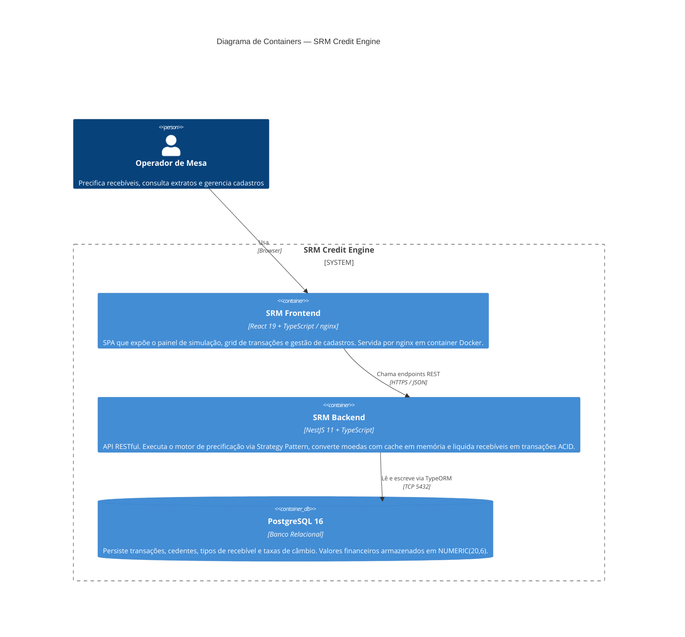

# C4 — Nível 2: Diagrama de Containers

```mermaid
C4Container
    title Diagrama de Containers — SRM Credit Engine

    Person(operador, "Operador de Mesa", "Precifica recebíveis, consulta extratos e gerencia cadastros")

    System_Boundary(srm, "SRM Credit Engine") {
        Container(frontend, "SRM Frontend", "React 19 + TypeScript / nginx", "SPA que expõe o painel de simulação, grid de transações e gestão de cadastros. Servida por nginx em container Docker.")

        Container(backend, "SRM Backend", "NestJS 11 + TypeScript", "API RESTful. Executa o motor de precificação via Strategy Pattern, converte moedas com cache em memória e liquida recebíveis em transações ACID.")

        ContainerDb(db, "PostgreSQL 16", "Banco Relacional", "Persiste transações, cedentes, tipos de recebível e taxas de câmbio. Valores financeiros armazenados em NUMERIC(20,6).")
    }

    Rel(operador, frontend, "Usa", "Browser")
    Rel(frontend, backend, "Chama endpoints REST", "HTTPS / JSON")
    Rel(backend, db, "Lê e escreve via TypeORM", "TCP 5432")
```