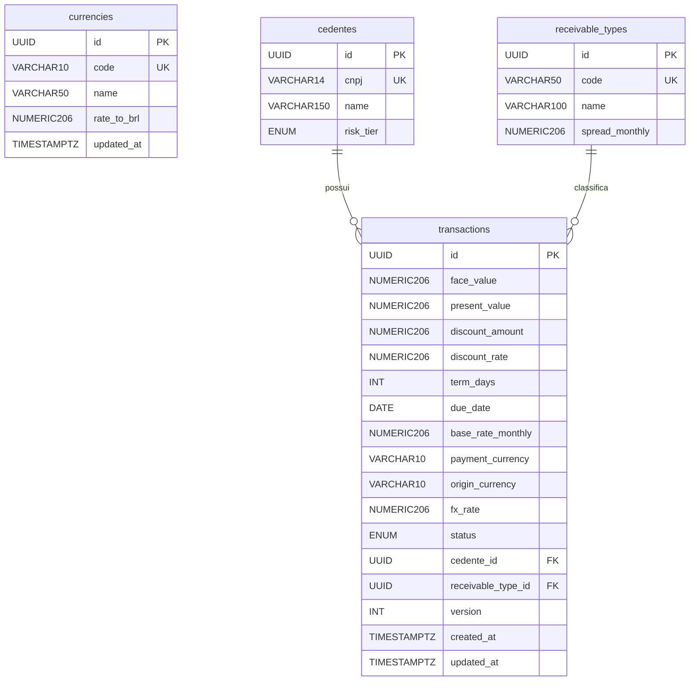

# Diagrama ER

> `currencies` não possui FK direto em `transactions` por design intencional. No momento da liquidação, a taxa de câmbio vigente é copiada para o campo `fx_rate` da transação como um snapshot imutável. Isso garante rastreabilidade auditável: alterações futuras na tabela `currencies` não afetam o histórico de operações já liquidadas. O mesmo princípio se aplica ao campo `base_rate_monthly`, que também é persistido por valor e não por referência.