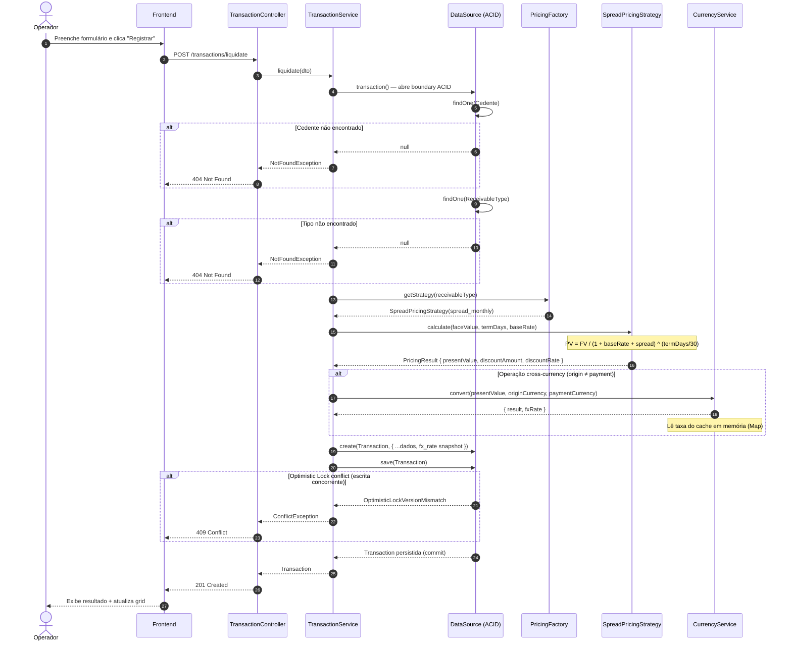

# Sequence Diagram — Liquidação de Recebível

```mermaid
sequenceDiagram
    autonumber
    actor Operador
    participant Frontend
    participant Controller as TransactionController
    participant Service as TransactionService
    participant DB as DataSource (ACID)
    participant Factory as PricingFactory
    participant Strategy as SpreadPricingStrategy
    participant Currency as CurrencyService

    Operador->>Frontend: Preenche formulário e clica "Registrar"
    Frontend->>Controller: POST /transactions/liquidate

    Controller->>Service: liquidate(dto)

    Service->>DB: transaction() — abre boundary ACID

    DB->>DB: findOne(Cedente)
    alt Cedente não encontrado
        DB-->>Service: null
        Service-->>Controller: NotFoundException
        Controller-->>Frontend: 404 Not Found
    end

    DB->>DB: findOne(ReceivableType)
    alt Tipo não encontrado
        DB-->>Service: null
        Service-->>Controller: NotFoundException
        Controller-->>Frontend: 404 Not Found
    end

    Service->>Factory: getStrategy(receivableType)
    Factory-->>Service: SpreadPricingStrategy(spread_monthly)

    Service->>Strategy: calculate(faceValue, termDays, baseRate)
    Note over Strategy: PV = FV / (1 + baseRate + spread) ^ (termDays/30)
    Strategy-->>Service: PricingResult { presentValue, discountAmount, discountRate }

    alt Operação cross-currency (origin ≠ payment)
        Service->>Currency: convert(presentValue, originCurrency, paymentCurrency)
        Currency-->>Service: { result, fxRate }
        Note over Currency: Lê taxa do cache em memória (Map)
    end

    Service->>DB: create(Transaction, { ...dados, fx_rate snapshot })
    Service->>DB: save(Transaction)

    alt Optimistic Lock conflict (escrita concorrente)
        DB-->>Service: OptimisticLockVersionMismatch
        Service-->>Controller: ConflictException
        Controller-->>Frontend: 409 Conflict
    end

    DB-->>Service: Transaction persistida (commit)
    Service-->>Controller: Transaction
    Controller-->>Frontend: 201 Created
    Frontend-->>Operador: Exibe resultado + atualiza grid
```